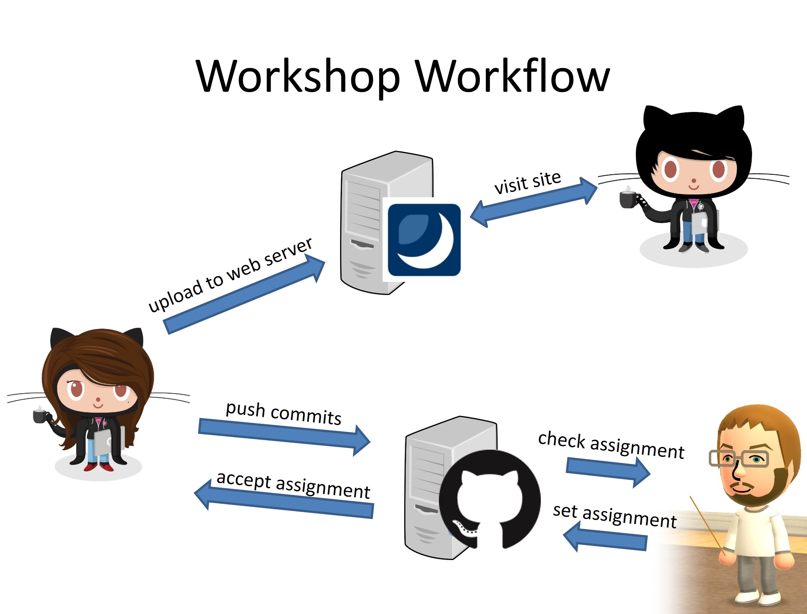

# BT2201 Task HTML Colours and Images

## Introduction

### Overview

The focus this week is on colours and images ..but this week we'll mix things up a bit. Instead of adding content to an existing html document that came with the repository you have to add html files yourself. 

### Editing

#### The quick way...

If you like you can create documents and edit them directly in GitHub's web interface. This is a very convenient way of creating and editing the files. 

If you want to test your files (especially in the future when we've started using PHP) you should upload them to your web space on bimserver2.com. 

#### The preferred way...

The preferred way of working is to create and edit the files on your own machine. 

To get the repository to your own machine you can use GitHub Desktop or link your GitHub account to PHPStorm (there are many more ways but these two are very convenient).
* You then upload these files to bimserver2 for testing.
* You commit changes and push the commits to your GitHub account to create a history of the changes over time.
* You _can_ work on several machines and use commits as a way of keeping the files on different machines up to date. 

## Task

Below is today's task. Make sure you add all files you create for this task to the same repository as the readme document you are currently reading. 

* Add at least three of the html files you have created in previous weeks to this repository.
* Add different background colours to these html files. 
* Find out how to colour text and use at least two different text colours in these html files.

If it is not already installed: install GIMP, a free graphics editor, on the computer you use in the workshops
You can also use Photoshop, but Photoshop is not free, so you can‘t use it on your own computer unless you have a licence. 
GIMP is free software, you can download and install it on your computer at home (http://www.gimp.org/downloads/ )
Add images to your files from last week’s workshop

The content of the elements, e.g. what text you put in the dropdown list, is up to you. 

* Add the final URL on bimserver2.com to a comment at the top of your files, like we did on the previous week. The comment was in line 2. 
* Give the page(s) a meaningful title (`<title></title>`).
* Upload the file(s) to your area on bimserver2.com.
* ☞Content, file and folder names (except links.html) are up to you.

You are welcome to copy and paste HTML from my lecture slides, but the quotes might need changing from opening double quotes (“) and closing double quotes (”) to straight double quotes ("). 
 
Commit early, commit often - that way you can go back if you have made a mistake and I can see all the work you have done. There's no problem if you commit and there's a mistake in your file.  

Once you are done be sure to commit your changes (that will save them to the repository) and to push them to GitHub (so that I can see the work you have done).

This task is part of your first assignment. **The deadline for this task is 0:00 on 21.11.2017** (GMT / UTC / Zulu time).  

As this task is part of the first assignment you should work individually, not with other students, and shouldn't show the final version of your files to other students, e.g. on the module discussion board.